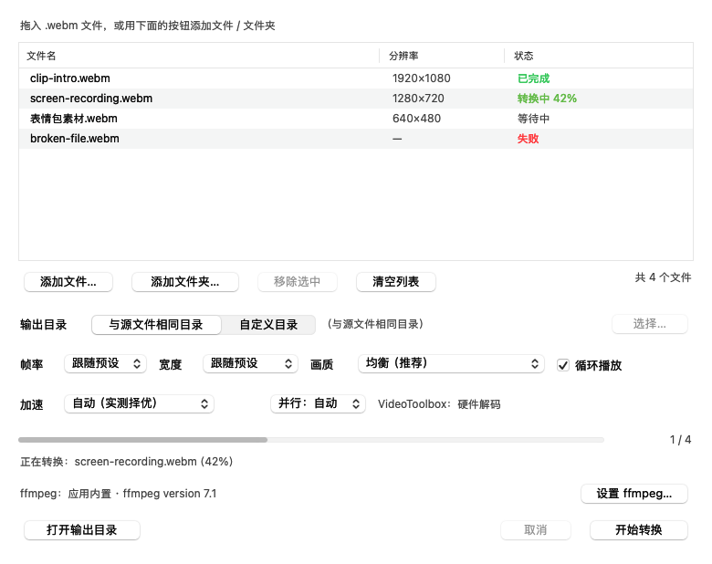

# WebM2GIF

**把 `.webm` 批量转成 `.gif` 的轻量 macOS 工具。** 原生 AppKit 界面，单窗口、无广告、无多余弹窗；
同一套转换流程也提供命令行模式，方便脚本化和自动化。针对 Apple Silicon 做了实测调优：可调用
VideoToolbox（媒体引擎）解码、GPU 缩放，并默认并行处理多个文件。




## 目录

- [功能亮点](#功能亮点)
- [快速开始](#快速开始)
- [关于 ffmpeg](#关于-ffmpeg)
- [界面说明](#界面说明)
- [硬件加速（Apple Silicon）](#硬件加速apple-silicon)
- [命令行用法](#命令行用法)
- [打包与分发](#打包与分发)
- [项目结构](#项目结构)
- [应用图标](#应用图标)
- [在 VSCode 中开发](#在-vscode-中开发)
- [常见问题](#常见问题)
- [开发说明](#开发说明)
- [许可](#许可)

## 功能亮点

- **原生界面**：PyObjC + AppKit 写的 single-window 应用，自动适配深色模式。
- **批量输入**：支持「添加文件…」（多选）、「添加文件夹…」（递归查找子目录），也可以把文件或
  文件夹**直接拖进列表**。
- **输出目录**：默认与源文件同目录，也可以指定任意文件夹，并自动记住上次的选择。
- **画质可控**：3 个预设，外加帧率 / 宽度 / 是否循环的单独覆盖；转换走 ffmpeg 的
  `palettegen` → `paletteuse` 调色板流程，颜色不丢。
- **进度可见**：逐文件状态（等待中 / 转换中 xx% / 已完成 / 失败）+ 总进度条，随时可以取消。
- **并行转换**：默认按 CPU 核心数同时转换多个文件，这是本工具最主要的提速手段
  （实测 4 个文件约 2×，小分辨率素材可达 2.7×），也可以在界面里固定并行数。
- **硬件加速**：可以调用 M 系列芯片的 VideoToolbox 解码、用 GPU 缩放。「自动」模式会先跑一次
  微素材实测，硬件解码更慢时保持 CPU——本机实测确实更慢，详见[下文](#硬件加速apple-silicon)。
- **不覆盖已有文件**：目标 GIF 已存在时自动改名为 `name (2).gif`。
- **命令行模式**：同一套转换逻辑也提供 CLI，方便脚本化 / 自动化。

## 快速开始

```bash
git clone https://github.com/<owner>/webm2gif.git
cd webm2gif

# 1) 创建本地虚拟环境并安装依赖（首次需要网络）
bash scripts/setup.sh

# 2) 启动界面
.venv/bin/python -m webm2gif

# 3) 可选：生成可双击运行的 WebM2GIF.app
make app
```

仓库里**不包含** `.venv/`、`build/`、`WebM2GIF.app/`——它们都是本机生成的产物（`.gitignore`
已忽略），按上面的步骤一条条跑即可。

先跑第 3 步再启动也可以：双击 `WebM2GIF.app` 即可打开界面；如果此时还没有 ffmpeg，
转换时会提示，点窗口里的「设置 ffmpeg…」手动指定一个已存在的 ffmpeg 也能用。

## 关于 ffmpeg

转换引擎是 ffmpeg，程序按下面的顺序自动查找，找到即用：

1. 界面上手动指定的路径（保存在 `~/Library/Application Support/WebM2GIF/settings.json`）
2. 环境变量 `WEBM2GIF_FFMPEG`
3. 应用包内置的 `WebM2GIF.app/Contents/Resources/bin/ffmpeg`
4. 虚拟环境里 `imageio-ffmpeg` 自带的静态 ffmpeg（`scripts/setup.sh` 会装好，**推荐**）
5. 系统 `PATH`、`/opt/homebrew/bin`、`/usr/local/bin`、`/opt/local/bin`

因此你有三种选择：

| 方式 | 命令 | 说明 |
| --- | --- | --- |
| 推荐 | `bash scripts/setup.sh` | 装进项目虚拟环境，随项目走，不污染系统 |
| Homebrew | `brew install ffmpeg` | 体积大、依赖多，但全局可用 |
| 手动指定 | 界面里点「设置 ffmpeg…」 | 已经有 ffmpeg 时最快 |

随时可以用 `.venv/bin/python -m webm2gif --check` 查看当前用的是哪一个。

## 界面说明

| 区域 | 说明 |
| --- | --- |
| 文件列表 | 文件名 / 分辨率（自动读取）/ 状态，可多选、可拖入 |
| 添加文件… | 打开多选面板，只列出 `.webm` |
| 添加文件夹… | 递归查找文件夹内所有 `.webm`（跳过隐藏文件） |
| 输出目录 | 「与源文件相同目录」或「自定义目录」，自定义时可点「选择…」 |
| 帧率 / 宽度 / 画质 | 默认「跟随预设」，也可以单独覆盖；源视频比目标宽度小时不放大 |
| 加速 | 硬件加速策略（自动 / 关闭 / VideoToolbox 解码 / + 缩放），右侧显示当前可用性 |
| 并行 | 同时转换的文件数；「自动」= 约一半核心数（最多 4 个），批量转换时提速明显 |
| 开始转换 | 后台线程逐个转换，界面不会卡住；`Esc` 取消，`Enter` 开始 |
| 打开输出目录 | 转换结束后在 Finder 中打开输出位置 |

### 画质预设

| 预设 | 帧率 | 最大宽度 | 颜色数 | 抖动 | 适用 |
| --- | --- | --- | --- | --- | --- |
| 高质量 | 20 fps | 720 px | 256 | sierra2_4a | 演示、需要清晰 |
| 均衡（推荐） | 15 fps | 540 px | 256 | bayer(5) | 通用 |
| 小体积 | 10 fps | 360 px | 128 | bayer(5) | 聊天表情、体积敏感 |

## 硬件加速（Apple Silicon）

先把话说清楚：**ffmpeg 的 GIF 流程里，只有「解码」和「缩放」两步可能离开 CPU**。

| 步骤 | 能否用硬件 | 说明 |
| --- | --- | --- |
| 解码 VP8/VP9 | ⚠️ 可以，但实测更慢 | `-hwaccel videotoolbox` 走媒体引擎（必须写在 `-i` 之前） |
| 缩放画面 | ✅ GPU（`scale_vt`） | 可选项，需自检通过；`hwupload → scale_vt → hwdownload` |
| 生成调色板 `palettegen` | ❌ 仅 CPU | ffmpeg 没有 GPU 实现 |
| GIF 编码 / LZW 打包 | ❌ 仅 CPU | 同上 |

**关于 NPU（神经网络引擎）**：ffmpeg 完全无法调用它。NPU 只通过 CoreML / Metal
Performance Shaders 暴露给应用，而 GIF 编码在 ffmpeg 里也没有 GPU/NPU 实现。所以
「用 M 芯片的 NPU 加速 ffmpeg 渲染」在技术上做不到，本项目不会假装支持。

### 实测结论（Apple Silicon 开发机）

同一份 1080p / 5s 的 VP9 素材，4 个文件，均衡预设，`.venv/bin/python tools/benchmark.py` 实测：

| 方案 | 总耗时 | 加速比 |
| --- | --- | --- |
| CPU 解码 · 串行 | 2.96s | 1.00× |
| **CPU 解码 · 并行 4** | **1.47s** | **2.01×** |
| VideoToolbox 解码 · 串行 | 3.64s | 0.81× |
| VideoToolbox 解码 · 并行 4 | 1.60s | 1.85× |
| VideoToolbox + GPU 缩放 · 并行 4 | 1.50s | 1.97× |

自检（1 秒 720p 微素材）也给出同样方向：硬件解码 `0.22s` vs 软件 `0.06s`，即 **0.25×**。

三个结论：

1. **VideoToolbox 解码在这台机器上比软件解码慢**。媒体引擎有固定的每帧开销，而软件 VP9
   解码能铺满所有核心；GIF 的调色板与编码又必须在 CPU 上跑，所以硬件解码省不回来。硬件解码的
   User CPU 时间确实低 20–25%，但总耗时更长。
2. **真正的提速来自并行**：多个 ffmpeg 同时跑，性能核与能效核都用上，4 个文件约 2×。
3. **`scale_vt` 只加速「缩放」这一小步**，与「CPU 并行」基本持平；它还要独占 VideoToolbox
   设备，所以选了「+ 缩放」就会退回软件解码。

用 `-j` 调并行、少给点宽度/帧率，比折腾硬件解码有效得多。

### 当前用的 ffmpeg 与「-hwaccel」

虚拟环境里 `imageio-ffmpeg` 自带的静态 ffmpeg（7.1）**已经启用了 VideoToolbox**，
`--check` 的真实输出：

```
硬件加速: VideoToolbox 可用（通过 -hwaccel videotoolbox 解码 WebM，GPU 缩放可用）
硬件自检: 硬件解码与 GPU 缩放均可用；解码实测慢于软件 0.26×
VideoToolbox : 可用
GPU 缩放     : 可用（scale_vt）
硬件解码器   : 无（使用 -hwaccel）
```

「硬件解码器：无」是正常的：**ffmpeg 7 之后移除了 `vp8_videotoolbox` / `vp9_videotoolbox`
这类专用解码器**（Homebrew 的 9.x 同样没有），只保留通用的 `-hwaccel videotoolbox`。
本项目用的就是这个通用开关，所以在 imageio 的 ffmpeg、Homebrew 的 ffmpeg 上行为一致，
不需要为了加速额外安装什么。

程序查找 ffmpeg 的顺序不变，但开启加速时会在候选里挑第一个「真的能用 VideoToolbox」的版本；
找不到就老老实实回到 CPU 解码，**绝不会因为加速失败而转换失败**：任何带硬件/GPU 的尝试
失败后都会自动用纯 CPU 重试一次，状态列显示「软件解码（硬件回退）」。

```bash
bash scripts/install_ffmpeg.sh        # 可选：brew install ffmpeg，只是想要一个全局 ffmpeg 时再装
```

### 界面里的「加速」

| 选项 | 含义 |
| --- | --- |
| 自动（实测择优） | 先用微素材实测硬件/软件解码，硬件不慢时才启用（本机实测更慢，因此保持 CPU） |
| 关闭（纯 CPU） | 完全软件处理，便于对比速度或排查问题 |
| VideoToolbox 解码 | 不管实测结果强制用媒体引擎解码，失败自动回退 CPU |
| VideoToolbox + 缩放 | 上面那条再把缩放交给 GPU（`scale_vt`，自检通过才生效；会退回软件解码） |

加速状态实时显示在选项右侧：`VideoToolbox：...` 灰色表示可用，橙色表示当前 ffmpeg 不支持、
或实测硬件更慢（鼠标悬停可看到具体原因）。

## 命令行用法

```bash
# 检查环境（ffmpeg、硬件加速、自检结果）
.venv/bin/python -m webm2gif --check

# 转换单个文件到指定目录
.venv/bin/python -m webm2gif --cli clip.webm -o ~/Desktop/gifs

# 整个文件夹 + 小体积预设 + 24fps + 播放一次
.venv/bin/python -m webm2gif --cli ~/Movies -o ~/Desktop/gifs --preset small --fps 24 --once

# 用 Makefile 快捷命令
make cli FILE=clip.webm ARGS="-o ~/Desktop/gifs --preset high"
```

可用参数：`--preset {high,balanced,small}`、`--fps N`、`--width N|source|preset`、
`--once`、`-r/--recursive`、`-o/--output DIR`、`--ffmpeg PATH`、`-q/--quiet`、`--version`、
`--hw {auto,off,videotoolbox}`、`--gpu-scale`、`-j/--jobs N`。

```bash
# 硬件解码（默认就是 auto，这里显式指定）+ GPU 缩放 + 4 路并行
.venv/bin/python -m webm2gif --cli ~/Movies -o ~/Desktop/gifs --hw videotoolbox --gpu-scale -j 4

# 纯 CPU 串行，用来对比速度
.venv/bin/python -m webm2gif --cli clip.webm --hw off -j 1
```

## 打包与分发

| 方式 | 命令 | 产物 | 说明 |
| --- | --- | --- | --- |
| 轻量版（默认） | `make app` | 约 200 KB 的 `.app` | 复用项目里的 `.venv`，改代码后立即生效，适合自己用 |
| 独立版 | `make standalone` | 数百 MB 的 `.app` | 用 PyInstaller 把 Python 和 ffmpeg 一起打包，可以拷给别人 |

两种方式都会做 ad-hoc 签名；独立版需要先 `pip install -r requirements-dev.txt`。

`.app` 属于构建产物，**不进仓库**。要发布给别人下载，推荐在 GitHub 上开一个 Release，
把 `make app` / `make standalone` 生成的产物作为附件上传。

## 项目结构

```
webm2gif/
├── webm2gif/                  # 应用源码
│   ├── __init__.py            # 版本号与常量
│   ├── __main__.py            # 入口：默认图形界面，带参数时走命令行
│   ├── app.py                 # NSApplication / 菜单栏 / 启动流程
│   ├── cli.py                 # 命令行模式（--check / --cli）
│   ├── ui/                    # AppKit 界面（窗口、表格、拖放、控件）
│   ├── converter.py           # 批量转换、并行调度、进度解析、取消、硬件失败回退
│   ├── options.py             # 画质预设与 ffmpeg 参数构造（含硬件解码 / GPU 缩放参数）
│   ├── hardware.py            # VideoToolbox 探测、真机自检与计时、解码方案选择、ffmpeg 择优
│   ├── ffmpeg.py              # 查找 ffmpeg、读取时长与分辨率
│   ├── discovery.py           # 输入文件收集与输出路径
│   └── settings.py            # 偏好设置持久化
├── tests/                     # pytest：单元 + 端到端（内置假 ffmpeg，覆盖硬件加速分支）
├── tools/
│   ├── build_app.py           # 打包 .app（轻量版 / PyInstaller 独立版）
│   ├── make_icon.py           # 图片 → AppIcon.icns（16–1024 px）
│   ├── benchmark.py           # 实测 CPU / VideoToolbox / 并行的耗时
│   └── preview_ui.py          # 无窗口渲染界面截图（docs/preview.png）
├── scripts/
│   ├── setup.sh               # 创建 .venv 并安装依赖
│   └── install_ffmpeg.sh      # （可选）安装 Homebrew 的 ffmpeg 并验证硬件加速
├── packaging/
│   ├── AppIcon.png            # 应用图标素材（换图标就换这张图）
│   ├── entry.py               # PyInstaller 入口
│   └── webm2gif.spec          # PyInstaller 配置
├── docs/
│   ├── preview.png            # 界面截图（README 引用）
│   └── icon.png               # 图标预览
├── .github/workflows/ci.yml   # GitHub Actions：flake8 + pytest
├── pyproject.toml             # 项目元数据、入口点、pytest 配置
├── requirements.txt           # 运行时依赖
├── requirements-dev.txt       # 开发依赖（pytest / flake8 / pyinstaller）
├── Makefile                   # 常用命令
└── .vscode/                   # 开箱即用的调试 / 任务 / 测试配置
```

## 应用图标

图标来自 `packaging/AppIcon.png`（建议 512×512 以上、正方形、带透明通道）：`make icon` 会把
它转成 `build/AppIcon.icns`（16/32/64/128/256/512/1024 全尺寸），`make app` 再把它装进
`WebM2GIF.app`；素材或生成脚本比 icns 新时，打包会自动重新生成。

```bash
# 换一张图
cp ~/Pictures/新图标.png packaging/AppIcon.png && make app

# 或者临时指定另一张图 / 不要 macOS 的圆角与留白
.venv/bin/python tools/make_icon.py --image ~/Pictures/新图标.png
.venv/bin/python tools/make_icon.py --full-bleed
```

默认会居中裁剪成正方形，套上和系统图标一致的圆角（squircle）与透明留白。
注意：图标素材是位图素材，公开发布前请确认你有权使用它，或直接换成自己的图。

## 在 VSCode 中开发

用 VSCode 打开项目目录即可，`.vscode/` 已经配置好：

- **解释器**：`.venv/bin/python`（打开时若未自动选中，用 `Python: Select Interpreter` 指定）
- **测试**：测试面板里可直接运行 `tests/`（pytest）
- **调试**：`运行 WebM2GIF（图形界面）`、`命令行：转换选定的 .webm`、`检查 ffmpeg 环境`、`渲染界面预览`
- **任务**：`Cmd+Shift+B` → `test: 运行全部测试`

常用命令：

```bash
make test        # 运行全部测试（pytest）
make preview     # 重新生成 docs/preview.png 界面截图
make app         # 重新构建 WebM2GIF.app
make icon        # 从 packaging/AppIcon.png 重新生成图标
make check       # 检查 ffmpeg 与硬件加速状态
make bench       # 实测 CPU / VideoToolbox / 并行的耗时
make ffmpeg      # （可选）安装 Homebrew 的 ffmpeg
```

因为 AppKit 可以在无窗口状态下渲染视图，测试可以直接把界面画成 PNG，方便在没有图形界面的
环境里检查布局：`.venv/bin/python tools/preview_ui.py --demo docs/preview.png`。

## 常见问题

**双击后提示「无法打开，因为 Apple 无法检查是否包含恶意软件」**
本机构建的产物没有隔离属性，一般不会出现；如果是从别处拷贝来的，执行一次：
`xattr -dr com.apple.quarantine WebM2GIF.app`。

**第一次转换时弹出「想访问桌面/文稿文件夹」**
macOS 的隐私保护要求，允许即可，之后不再询问。

**Dock 图标名称显示为 Python**
轻量版通过脚本启动系统 Python，Dock 悬停名称会显示为 Python（菜单栏和图标都正常）。
需要完全以「WebM2GIF」身份出现时，用 `make standalone` 构建独立版。

**转换速度/体积**
GIF 体积主要由「宽度 × 帧率 × 时长」决定。体积太大时优先选「小体积」预设，或手动把宽度调小。

**加速那行显示橙色**
两种原因：① 当前 ffmpeg 没启用 VideoToolbox，`brew install ffmpeg` 后会自动切换；
② 硬件解码实测比软件慢（本机就是 0.26×），此时「自动（实测择优）」会继续用 CPU——这是
预期行为，不是故障。想亲自验证硬件路径，把「加速」改成「VideoToolbox 解码」即可。

**为什么 GPU 占用不高**
GIF 的调色板和编码只能在 CPU 上跑，硬件加速只接管解码（和可选的缩放）；瓶颈通常仍在 CPU 侧。
想更快，优先提高「并行」数，或者用更小的宽度/帧率。

**能不能用 NPU（神经网络引擎）加速**
不能。ffmpeg 无法访问 NPU，GIF 编码也没有 GPU/NPU 实现；本项目会在 `--check` 里如实说明这一点。

**某个文件失败**
状态列显示「失败」，鼠标悬停可以看到 ffmpeg 的具体报错；常见原因是源文件损坏或不含视频轨道。
批量转换时单个失败不会中断其余文件。

**进度条不动**
读取不到源文件时长时（少见），进度条会按「已完成文件数」推进，而不是当前文件的百分比。

## 开发说明

- 环境：Python 3.10+（开发机使用 3.13），界面依赖 `pyobjc-framework-Cocoa`，ffmpeg 由
  `imageio-ffmpeg` 提供。`pyproject.toml` 里声明了同样的依赖与 `webm2gif` 命令入口，
  需要时可以直接 `pip install -e ".[dev]"`。
- 转换参数集中在 `webm2gif/options.py`，调整画质/体积改这里即可，测试会一起校验。
- 硬件加速逻辑集中在 `webm2gif/hardware.py`：能力探测 → 真机自检（实测两条路径）→ 选择解码方案。
- `tests/conftest.py` 里有一个「假 ffmpeg」脚本，可以在没有真实 ffmpeg 的机器上完整验证进度解析、
  取消、失败处理、硬件回退等流程；用 `FAKE_FFMPEG_HW=0`、`FAKE_FFMPEG_HW_FAIL=1` 等环境变量
  可以模拟「没有硬件」「硬件初始化失败」等情况。
- 提交前请跑一遍 `make test`；改动界面后再跑一次 `make preview`，让 `docs/preview.png` 保持最新。

## 许可

[MIT](LICENSE)。
